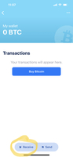
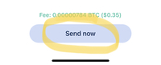

# How to import Bitcoin into your own wallet (iOS)
<!-- ID FOR DISTRIBUTION -->

1. Open the App Store and search for Bluewallet. Download the app. This is what the app icon looks like: 

2. Open the Bluewallet App. In the top-right corner there is a Plus button. Hit it 

3. On the “Add Wallet” screen, name the wallet “Imported Wallet” and then click the “Import Wallet” button at the bottom

4. On the next screen, tap "Scan or import file". It will open the camera. Scan this QR code:

If you have trouble with the QR Code, you can also type this in the import field:
INSERT_PRIVKEY_HERE

5. You will see a message that the wallet has been successfully imported.
6. Click the “Plus Button” at the top of the Bluewallet home screen again (like from Step 2)
7. For the wallet name, type “My wallet”, and then select “Bitcoin”, and then click “Create”

8. On the next screen you will see a list of 12 words. Write these down on paper. Do not take a picture of them or store them online (like in your email). These 12 words are a backup that can be used to restore your new wallet in case you lose your phone. If someone steals those 12 words, they can spend your bitcoin. Keep them safe! After you’ve written them down, click the “Ok, I wrote it down” button.
9. You should now be on the wallets home screen. Tap the blue rectangle that says “My wallet”. This will open the new wallet you just created.

10. At the bottom of the screen, tap the “Receive” button

11. You will see a QR code with a long string of numbers underneath it starting with “bc1q” (see screenshot). This is a bitcoin address. Tap on that address and it will say “Copied to Clipboard”

12. Close the “Receive” screen by tapping the X in the top-right corner, then go back to the wallets home screen by tapping the < in the top left corner.
13. Tap the blue rectangle for the Imported wallet to open it (the balance shown on the wallet may be different from what is displayed in the screenshot).

14. At the bottom of the screen, click the “Send” button.
15. Tap where it says “0 BTC” and it will open a number entry keyboard. Just above the number “1” it will show the total balance of the imported wallet. Tap that. It will ask if you want to “Use full balance”. Tap Ok. The amount will now read “MAX”
 
16. In the “Address” field, paste in the address that you copied in step 11. Then tap the “Next” button.

17. At the bottom of the next screen, tap the “Send now” button

18. You will see a screen with a blue checkmark saying that the transaction has been sent. Tap the “Done” button at the bottom of the screen.
19. You will now see a new transaction in both the “Imported Wallet” and in “My Wallet” with a status of  “Pending”. After a little while it will change to show the number of confirmations that the transaction has received. This can take anywhere from 10 minutes to an hour. Don’t worry, it will happen on its own and you don’t need to do anything.

20. Once the transaction has been confirmed, delete the imported wallet by opening the “Imported Wallet” and tapping on the three dots in the upper right hand corner. Then on the next screen, click “Delete” at the very bottom. Then “Yes, delete”.
  

**Congratulations!** You now have bitcoin in your own wallet in Bluewallet. Nobody can seize those funds and you can spend them however you choose. 

